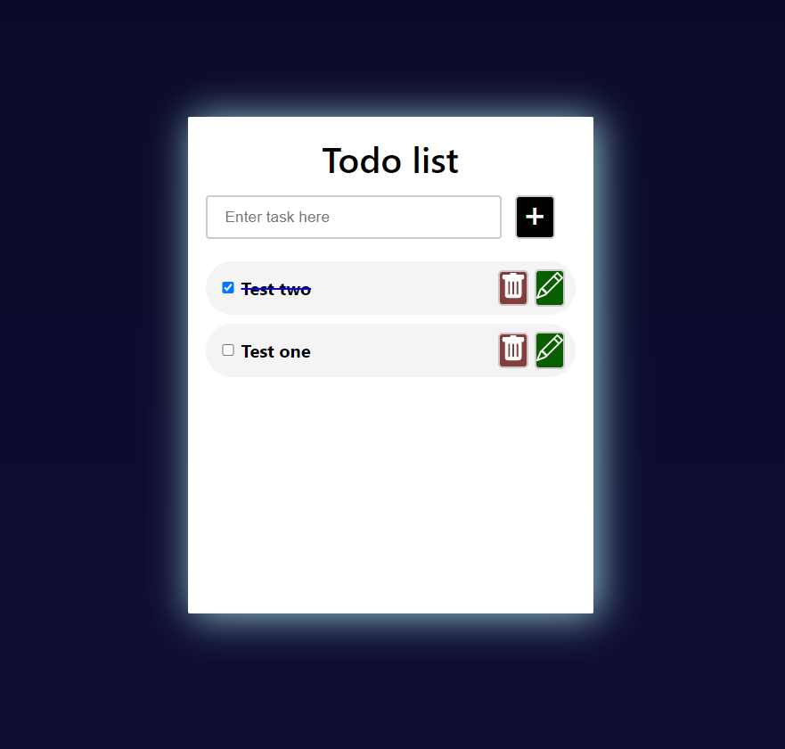

# Todolist Web Application

## The Site: https://heroic-unicorn-3ffc9d.netlify.app/

## Introduction

This is a simple client side React.js application for creating a todolist by the user.
All CRUD (Create, Read, Update, Delete) operations are available.
The Data stores at localStorage and perform at the todolist page.

## Built with

- React.js
- Styled-components

## Getting Started

Setup:
npm i / yarn add
